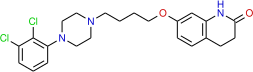
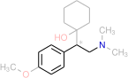
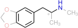
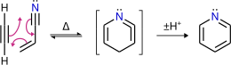
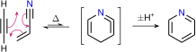

# LaTeX `chemfig` Package Examples

## Overview

I've made a bunch of `chemfig` examples because I often find the package confusing if it has been a while. I prefer it to ChemDraw et al., for drawing structures and reactions as it is free in both sense of the word.

I've done a bunch of customisation (visible in `config.tex`) to get the produced images looking like I want them too, which requires the **FreeSans** font (which requires `lualatex` to use). 

The `build` script is a `bash` script that automates the process of exporting the structures/schemes as `.svg` images for both light and dark backgrounds, as well as performing some organising and cleanup each time it is run. The script requires `pdf2svg`, `pdfcrop` and a version of `sed` that can use the `-i` flag. 

## Examples

1. Structure of aripiprazole
2. Structure of venlafaxine with phenethylamine backbone indicated
3. Structure of MDMA with phenethylamine backbone indicated
4. Structure of escitalopram with stereochemistry indicated
5. A representative scheme of the pentadehydro Diels-Alder (PDDA) reaction

